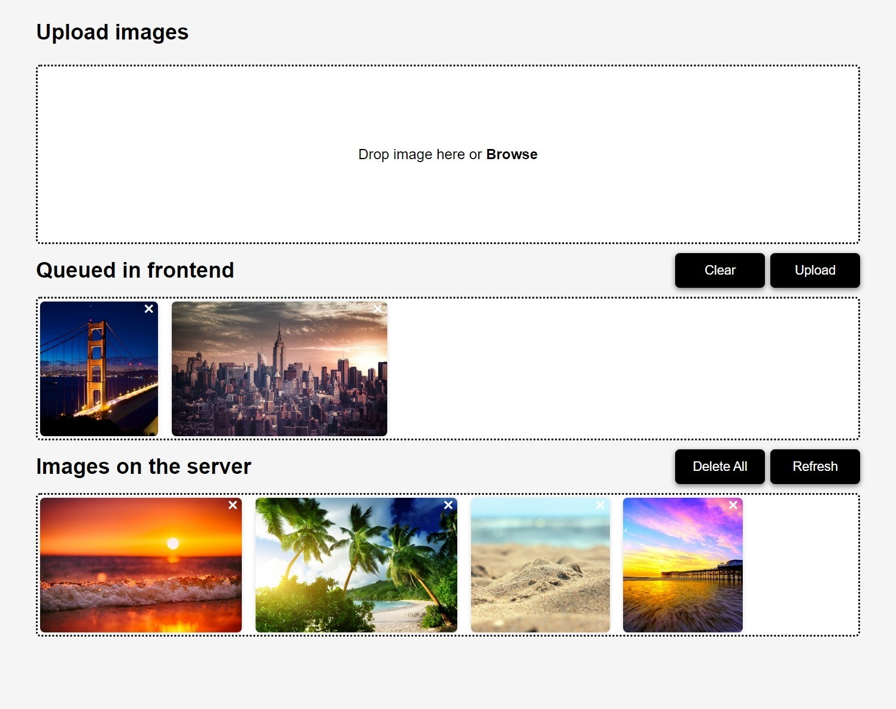
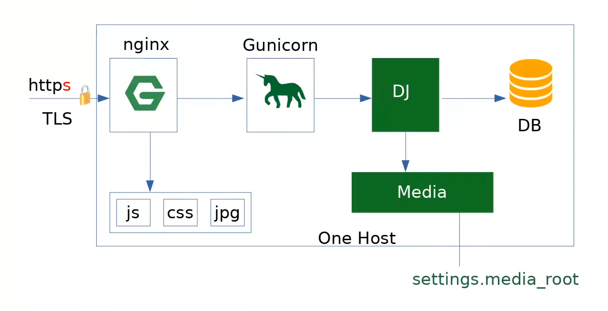

# A simple app that upload images to server.

This project is heavily inspired by these video series:

[How to Upload Images with JavaScript ( The Ultimate Guide )](https://www.youtube.com/watch?v=EaBSeNSc-2c&list=PLtMugc7g4GarZmGHoO7Yig7e9I2rGMifR) by Web Dev Tutorials

[Django Media Files - Handling User Uploads in Django Forms & Models](https://www.youtube.com/watch?v=lKyH_ZGtvwM) by BugBytes

[Deploy Django - From Zero to Hero](https://www.youtube.com/playlist?list=PLlM3i4cwc8zBRQOGXuLrCLNfpVOuVLuwZ) by Django Lessons

## Introduction

This project uses Django REST Framework (DRF) as backend and React as frontend.

This project demonstrate how to handle file upload in a web application, as well as how to deploy the project.

**Warning:** Authentication is deliberately disabled for simplicity, use with care!



## How to Deploy

Django refuses to handle static files and media files when `DEBUG` is truned off.

So Nginx is required to handle static files and media files, also django should be runned by dedicated WSGI server like Gunicorn.



### `.env` settings:

- SECRET_KEY
- DJANGO_DEBUG
- STATIC_ROOT
- MEDIA_ROOT

### Nginx config example

```nginx
server {
    listen 80;

    location / {
        proxy_pass http://127.0.0.1:8001;
    }

    location /static {
        root STATIC_ROOT;
    }

    location /media {
        root MEDIA_ROOT;
    }
}
```

### Connect with mysql

Install pymysql with pip.

```shell
pip install pymysql
```

In `__init__.py` file, configure pymysql.

```python
import pymysql
pymysql.install_as_MySQLdb()
```

In `settings.py`, configure mysql connection options.

```python
DATABASES = {
    "default": {
        "ENGINE": "django.db.backends.mysql",
        "NAME": "database name",
        "USER": "user",
        "PASSWORD": "password",
        "HOST": "host",
        "PORT": 3306,
    }
}
```

### Generate drf-spectacular schema

```shell
python manage.py spectacular --color --file schema.yml
```

### Authentication

If you want to use django's admin pannel properly, configure CSRF is needed.

```python
CSRF_TRUSTED_ORIGINS = ["https://example.com"]
```

### Before run the server

Backend 

```shell
cd backend
pip install -r requirements.txt

python manage.py collectstatic
python manage.py makemigrations api
python manage.py migrate
```
Frontend

```shell
cd frontend
npm i
npm run build
```

### Start Django server with Gunicorn

Install Gunicorn with pip.

```shell
pip install gunicorn
```
Start server on port 8001.

```shell
gunicorn backend.wsgi -b 127.0.0.1:8001
```